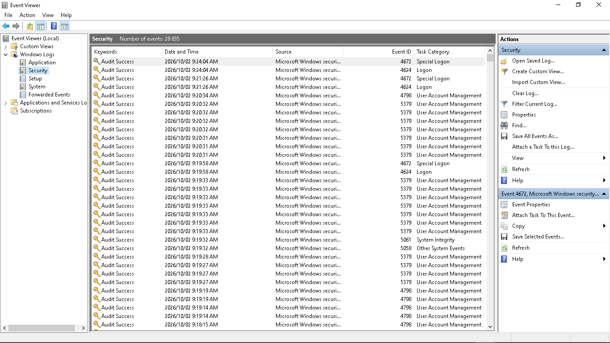
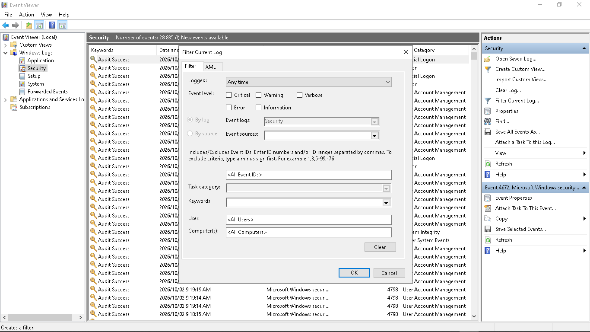
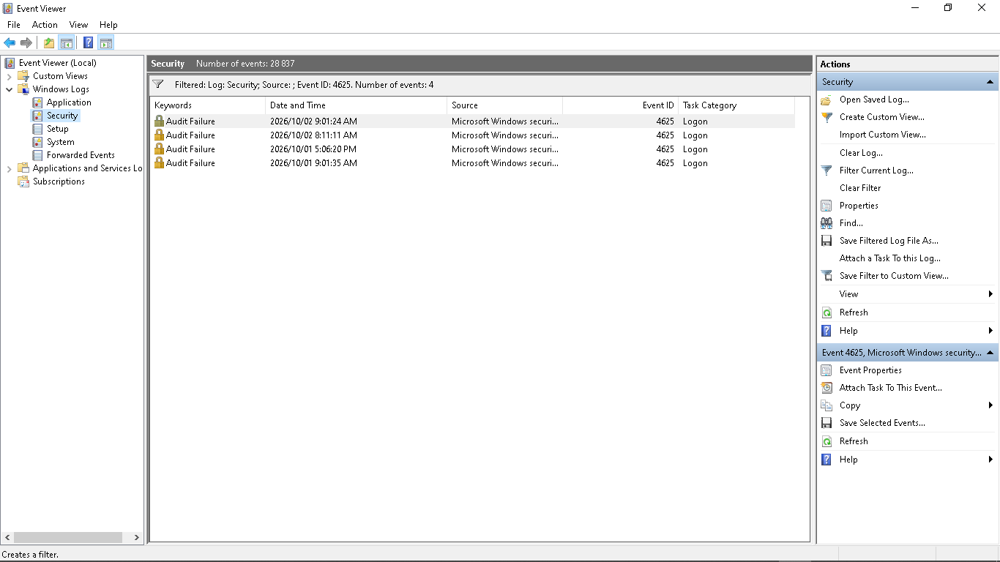
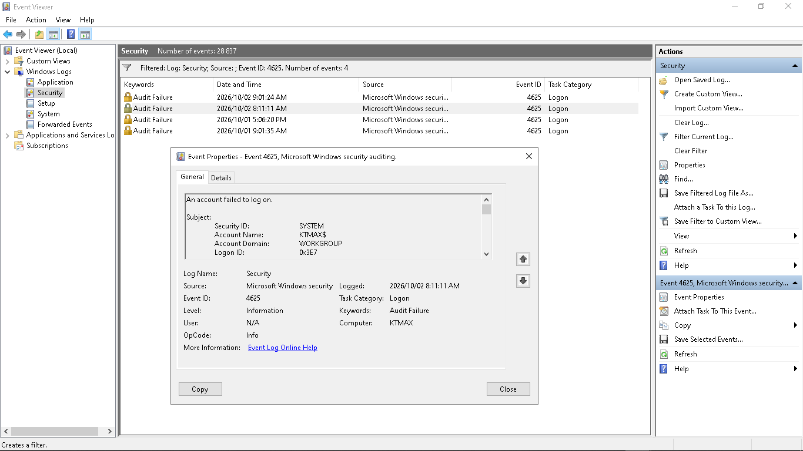
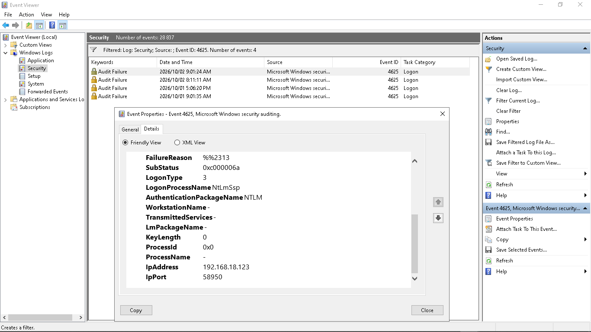
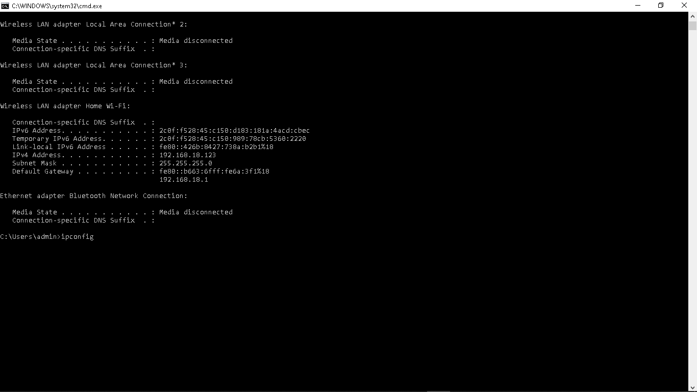
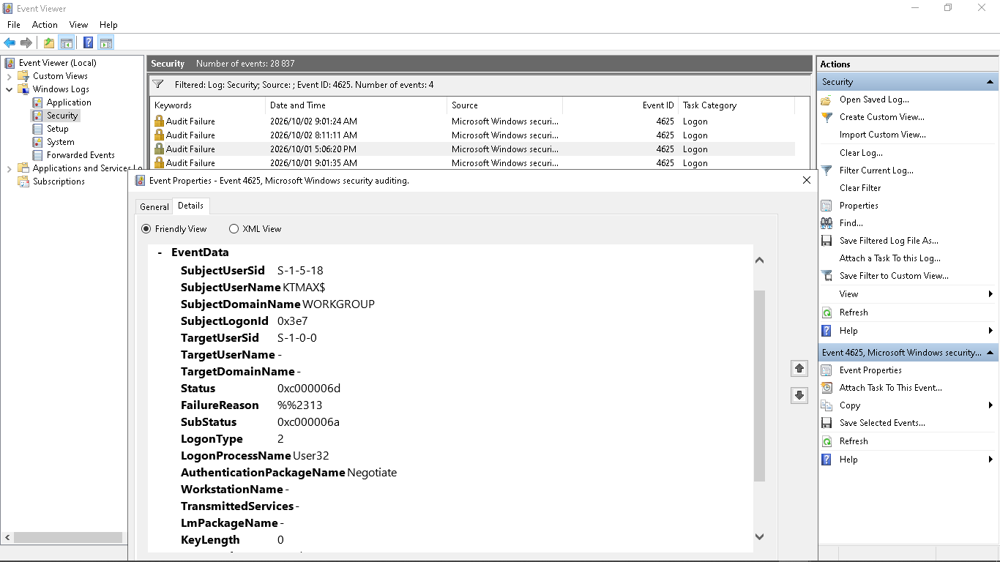
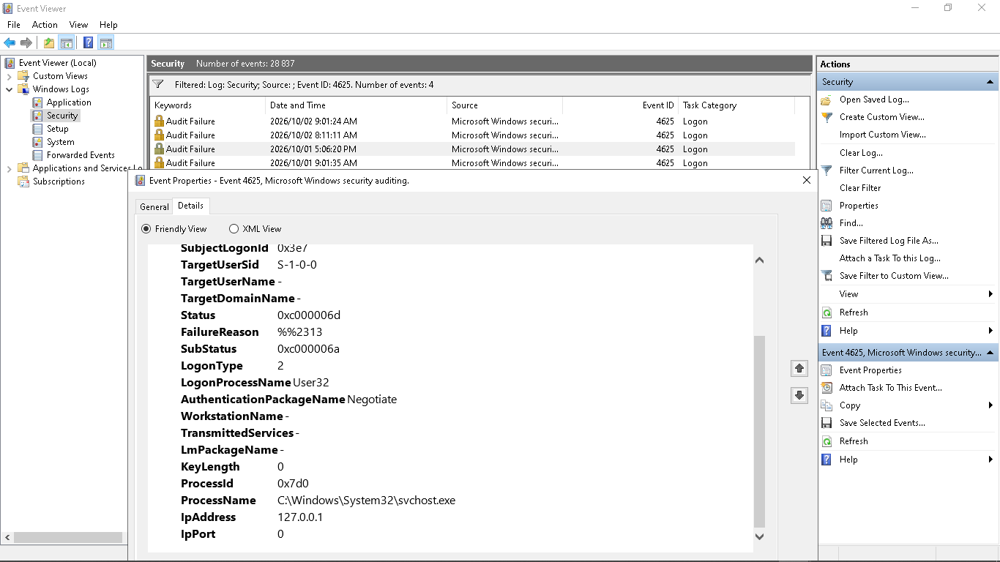

# Windows Security Log Analysis

## Project Overview

This project demonstrates practical Windows security log analysis using Microsoft Windows Event Viewer. The objective was to investigate failed authentication attempts recorded in the Windows Security log and interpret the information contained within Event ID 4625.

During the investigation, multiple failed logon events were identified and analysed to determine the attempted account, authentication method, logon type, failure reason, source IP address, and originating process.

## Objectives

- Navigate and analyse Windows Security logs using Event Viewer.
- Filter security events using Windows Event IDs.
- Investigate failed authentication attempts using Event ID 4625.
- Interpret logon types and authentication packages.
- Identify the source of authentication attempts using IP address information.
- Analyse Windows authentication failure codes.
- Distinguish between local and network-based failed logon attempts.
- Document findings using screenshots and technical observations.

## Tools Used

- Microsoft Windows
- Windows Event Viewer
- Windows Security Logs
- Command Prompt
- `ipconfig`

## Security Event Investigated

### Event ID 4625 — An Account Failed to Log On

Windows Event ID 4625 records failed account logon attempts.

The Security log was filtered for Event ID `4625`, revealing multiple authentication failures that could then be examined individually.

The investigation included analysis of:

- Target user account
- Logon type
- Authentication package
- Failure reason
- Status and sub-status codes
- Source IP address
- Source port
- Process information

## Key Findings

Multiple Event ID 4625 records were identified during the investigation.

Examples included:

- Failed interactive/local authentication attempts using **Logon Type 2**.
- Failed network authentication attempts using **Logon Type 3**.
- Authentication using **NTLM** and **Negotiate**.
- Failure status `0xC000006D`, indicating unsuccessful authentication.
- Sub-status `0xC000006A`, associated with an incorrect password for the attempted account.
- A network logon failure associated with the source IP address `192.168.18.123`.
- A separate event associated with the loopback address `127.0.0.1`, indicating activity originating from the local computer.

## Initial Security Assessment

The investigation demonstrates why a single failed logon event should not automatically be classified as malicious activity.

Security analysts should examine the surrounding context, including the source address, account name, logon type, authentication method, timing, frequency, and related events before determining whether authentication failures represent normal user activity, a configuration issue, or potentially suspicious behaviour.

## Skills Demonstrated

- Windows Security Log Analysis
- Windows Event Viewer
- Event ID Investigation
- Authentication Analysis
- Failed Logon Investigation
- IP Address Analysis
- Windows Authentication
- Basic SOC Investigation
- Security Event Documentation

## Investigation Evidence

The following screenshots document the Windows Security log investigation and the process used to identify and analyse failed authentication events.

### 1. Windows Security Log

The Windows Security log was reviewed in Event Viewer to identify authentication-related security events.

### 2. Filtering for Event ID 4625

The Security log was filtered for Event ID `4625`, which records failed account logon attempts.

### 3. Failed Logon Events Identified

Filtering revealed multiple Event ID 4625 audit failures. This provided a focused set of authentication failures for further investigation.

### 4. Event 4625 Investigation

An individual Event ID 4625 record was opened to examine the failed authentication attempt and its associated event information.

### 5. Local Authentication Analysis

One investigated event showed **Logon Type 2**, which represents an interactive logon. The event also contained authentication and process information that helped provide context for the failure.

### 6. Local IP Address Verification

The `ipconfig` command was used to verify the computer's IPv4 configuration. The system was using IPv4 address `192.168.18.123` on the local network.

### 7. Network Authentication Analysis

Another Event ID 4625 record showed **Logon Type 3**, representing a network logon attempt. The event used NTLM authentication and recorded an unsuccessful authentication attempt.

### 8. Source IP Correlation

The network logon event recorded source IP address `192.168.18.123`. Comparing this value with the `ipconfig` results showed that the source address matched the investigated computer's own IPv4 address.

This correlation is important because an IP address appearing in a failed authentication event should not automatically be treated as evidence of an external attacker. The source address, logon type, account, authentication package, process information, and surrounding events must be considered together.

---

## Investigation Conclusion

The investigation identified multiple Windows Event ID 4625 failed authentication events and demonstrated how individual log records can be analysed using logon type, authentication package, status information, source address, and process data.

The analysis also demonstrated the importance of correlating security logs with host and network information. In this case, comparison with the system's IP configuration showed that `192.168.18.123` belonged to the investigated computer itself, preventing the source address from being incorrectly interpreted as evidence of an external system.

This lab demonstrates a basic SOC investigation workflow: identify relevant security events, filter the available data, inspect individual records, correlate evidence from multiple sources, document findings, and avoid drawing conclusions without sufficient context.
